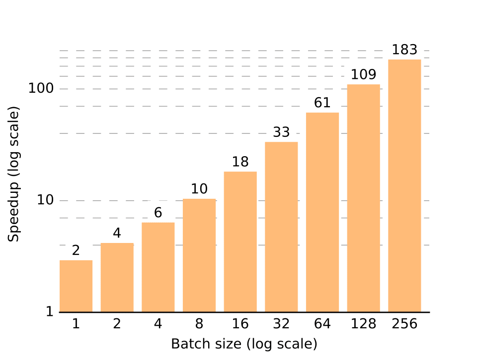
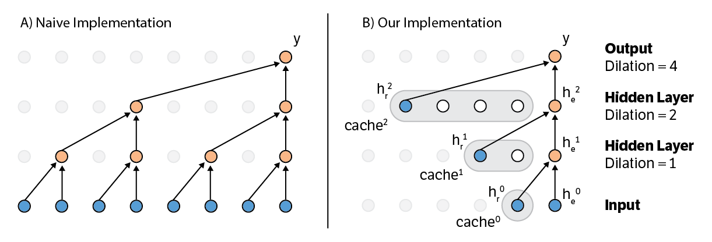
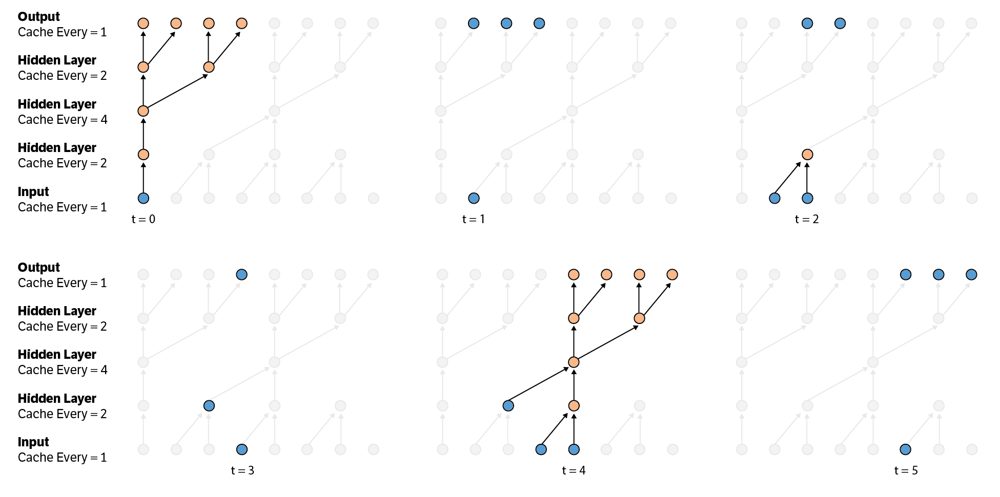

# Fast PixelCNN++: speedy image generation

*Real time generation of 16 32-by-32 images. Naive generation (left) vs. fast generation (right).*


<p align="center">
  
</p>

We speed up the image generation algorithm of [PixelCNN++](https://github.com/openai/pixel-cnn) by avoiding redundant computation through caching. Naive generation discards computation that can be re-used and performs additional computation that will not be used to generate a particular pixel.  Naive generation can take up to 11 minutes to generate 16 32-by-32 images on a Tesla K40 GPU. By re-using previous computation and only performing the minimum amount of computation required, we achieve up to a 183 times speedup over the naive generation algorithm.

<p align="center">
  
</p>

## How to run
We have tested our code with Python 3 and TensorFlow 1.0. You may need to make small changes for other versions of Python or TensorFlow.

Instructions to run:
* Install [TensorFlow 1.0](https://www.tensorflow.org/install/), Numpy, and Matplotlib
* Download and unzip [OpenAI's pretrained PixelCNN++ model](http://alpha.openai.com/pxpp.zip). After unzipping, there should be a file called `params_cifar.ckpt`
* Run the script with `CUDA_VISIBLE_DEVICES=0 python generate.py --checkpoint=/path/to/params_cifar.ckpt --save_dir=/path/to/save/generated/images`

The script will continually generate images in a loop and write out the images to `--save_dir`. You can exit the script at any time by interrupting with Control-C.

## How it works

### What is PixelCNN++, and why should I use it?

PixelCNN++ is a generative model that uses all previously generated pixels as information to generate the next pixel. That is, to generate the 10th pixel in the image, PixelCNN++ will look at pixels 1-9 to model the output distribution of pixel 10: `P(pixel 10 | pixel 1, ..., pixel 9)`. Similarly, pixel 11 will look at pixels 1-10, and this process continues for all pixels. This property makes PixelCNN an *autoregressive* model, where each pixel is modeled by the history of previous pixels. What makes PixelCNN unique is that it uses clever, fast methods to coalesce information from previous pixels, which is crucial for training speed.

PixelCNN was [original developed by DeepMind](https://arxiv.org/abs/1606.05328) and [improved upon by OpenAI](https://openreview.net/pdf?id=BJrFC6ceg) in PixelCNN++. These models have achieved state-of-the-art results on a variety of image generation benchmarks. They are straightforward to train, have a large capacity to model complex inputs, and are able to generate crisp, attractive images. For example, PixelCNN has [recently been used for superresolution](https://arxiv.org/abs/1702.00783).

One of the main downsides of autoregressive models compared to other generative models like [Generative Adversarial Networks](https://arxiv.org/abs/1701.00160) and [Variational Autoencoders](https://arxiv.org/abs/1606.05908) is that autoregressive models must generate pixels one at a time, whereas other methods can generate the entire image at once. Our method speeds up the generation process for PixelCNN.

### Speeding up a simple 1D example with dilation

Before jumping into the details of speeding up PixelCNN, let's focus on a simpler 1D autoregressive model: [Wavenet](https://arxiv.org/abs/1609.03499). The details presented here are the similar to that of our other repository, [Fast Wavenet](https://github.com/tomlepaine/fast-wavenet), which you can refer to for more details.



The Wavenet graph (on the left) looks like a binary tree. A node is convolved with it's `nth` previous neighbor, where `n` is a power of 2. Since `n`, the *dilation*, is increasing by a factor of two every layer, the range of nodes that are combined together, the *receptive field*, increases exponentially. On every generation step, information from all nodes in the receptive field (8 in the picture) must be combined. A naive generation algorithm simply repeats the entire tree of computation for every generation step. This is easy to implement, but is slow.

You may have noticed that when generating consecutive outputs, a large portion of the tree is reused. For example, call the current step in the picture `t` and imagine generating the output for `t + 2`. In this case, three of the four orange nodes in the first hidden layer can be reused! It is a waste of time to recompute them.

This brings us to the core of our method: caching previously computed hidden states. As illustrated in the image on the right, we maintain a cache for each layer which holds previously computed hidden states. The size of the cache is equal to the dilation factor of the hidden layer since the model must look back `n` steps at the hidden layer. The cache acts like a queue: the oldest hidden state is popped from the the front of the queue, which is exactly equivalent to the normal dilated convolution. After a hidden state is computed, it must then be pushed into the back of the queue, to be used exactly `n` steps in future from now. This process repeats itself, giving a fast generation algorithm that avoids the exponential computation of the naive approach.

### Speeding up strided convolutions

The previous section used dilated convolutions. In this case, node `t` is convolved with node `t - n`, and node `t + 1` is convolved with node `t + 1 - n`. This implies that the number of hidden states in a layer is equal to the number of inputs, making caching straightforward. However, using strided convolutions makes the problem more difficult because the number of states in a hidden layer is different from the number of inputs.

Strided convolutions are downsampling layers. This means that there are fewer hidden states than inputs. A typical convolution will convolve over a local neighborhood and then slide 1 position over and repeat the procedure. For example, nodes `t - 1` and `t` will be convolved, and then nodes `t` and `t + 1` will be convolved. Striding affects the number of positions that the convolution will slide over. In the previous example, the stride is 1. However, when the stride is greater than 1, the input is downsampled. For example, take the stride to be 2. Nodes `t - 1` and `t` will be convolved, and then nodes `t + 1` and `t + 2` will be convolved, since the convolution has slided 2 positions over. This means every pair of inputs to the layer only produces one output, so the number of hidden states is smaller than the number of inputs.

Similarly, there are upsampling layers, which are strided transposed convolutions. With a stride of `s`, upsampling layers will produce `s` outputs for every input to the layer. This increases the number of hidden states compared to the number of inputs to the layer. PixelCNN++ uses 2 downsampling layers followed by 2 upsampling layers, each of stride 2, meaning that the number of generated pixels is the same as the number of input pixels (i.e. `D / 2 / 2 * 2 * 2 = D`). A detailed explanation of strides and transposed convolutions can be found [here](https://github.com/vdumoulin/conv_arithmetic) and [here](https://arxiv.org/abs/1603.07285).

Because of the differing number of hidden states, caches cannot be updated in every timestep. Thus, each cache has an additional property `cache every`, where the cache is only updated every `cache every` steps. Every downsampling layer increases the `cache every` property of the layer by the stride. Conversely, every upsampling layer decreases the `cache every` property of the layer by the stride.



The figure above shows an example model with 2 upsampling and 2 downsampling layers each with a stride of 2. Orange nodes are computed in the current timestep, blue nodes are previously cached states, and gray nodes are not involved in the current timestep.
* At the first timestep `t = 0`, the first input is used to compute and cache all nodes for which there is sufficient information to generate, including the first four outputs.
* At `t = 1`, there are no nodes that have sufficient information to be computed, but the output for `t = 1` has already been computed at `t = 0`.
* At `t = 2`, there is one new node that now has sufficient information to be computed, although the output for `t = 2` has also been computed at `t = 0`. 
* The `t = 3` scenario is similar to `t = 1`.
* At `t = 4`, there is enough information to compute multiple hidden states and generate the next four outputs. This is analogous to the `t = 0` scenario.
* `t = 5` is analogous to `t = 1`, and this cycle is followed for all future time steps.

In our code, we also use a property `run every` which is equal to the `cache every` property of the next layer. This allows us to avoid computation if the next layer is simply going to ignore its input.

### Speeding up PixelCNN++

After understanding the previous sections, it should seem relatively straightforward to generalize the 1D example to the 2D case. Indeed, our method generalizes with very few changes. The caches for each layer are now 2D, with a height equal to the filter height and a width equal to the image width. After an entire row is generated, the oldest row of the cache is popped and the new row is pushed. Because strided convolutions are used, we use the `cache every` idea detailed in the previous section.

PixelCNN maintains two streams of computation: a vertical stream and a horizontal stream. Oversimplifying the details a bit, the vertical stream looks at all pixels above the current pixel while the horizontal stream looks at all pixels immediately left of the current pixel, satisfying the autoregressive property in the 2D case (see the PixelCNN papers for a more precise explanation). The horizontal stream also takes in the vertical stream as another input. In our code, we compute the vertical stream one row at a time, cache it, and use it to compute the horizontal stream (and the generated output) one pixel at a time.

And with this, we are able to achieve orders of magnitude speedups for PixelCNN++ generation! Increasing the batch size demonstrates the scalability of our method. While the naive implementation scales linearly with the batch size (because of 100% GPU utilization), our method enjoys superior scaling because of its minimal computational requirements.

<p align="center">
  
</p>

### Beyond PixelCNN++

The core concepts detailed here will easily generalize for different modalities. For example, speeding up the [Video Pixel Network](https://arxiv.org/abs/1610.00527) for generating videos should look straightforward, and will probably produce even more impressive speedups because of the higher computational demand. We look forward to hearing about practical uses of fast generation for convolutional autoregressive models!

## Authors

* [Prajit Ramachandran](https://github.com/PrajitR)
* [Tom Le Paine](https://github.com/tomlepaine) 
* [Pooya Khorrami](https://github.com/pkhorrami4) 
* [Mohammad Babaeizadeh](https://github.com/mbz)

If you found this work useful, please cite our [paper](https://arxiv.org/abs/1704.06001).

```
@article{ramachandran2017fast,
  title={Fast Generation for Convolutional Autoregressive Models},
  author={Ramachandran, Prajit and Paine, Tom Le and Khorrami, Pooya and Babaeizadeh, Mohammad and Chang, Shiyu and Zhang, Yang and Hasegawa-Johnson, Mark A and Campbell, Roy H and Huang, Thomas S},
  journal={arXiv preprint arXiv:1704.06001},
  year={2017}
}
```
